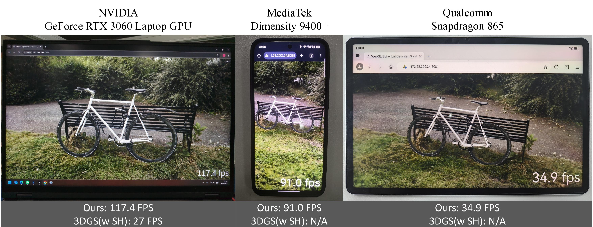

# MEGS²: Memory-Efficient Gaussian Splatting via Spherical Gaussians and Unified Pruning (ICLR 2026)
<!-- <p align="center">
Jiarui Chen*, Yikeng Chen*, Yingshuang Zou, Ye Huang, Peng Wang, Yuan Liu, Yujing Sun, Wenping Wang
</p> -->


<div align="center">

Jiarui Chen<sup>1*</sup>, Yikeng Chen<sup>1,2*</sup>, Yingshuang Zou<sup>1</sup>, Ye Huang<sup>3</sup>, Peng Wang<sup>4</sup>, Yuan Liu<sup>1</sup>, Yujing Sun<sup>5</sup>, Wenping Wang<sup>6</sup>

<sup>1</sup> The Hong Kong University of Science and Technology
<sup>2</sup> Shenzhen University
<sup>3</sup> Sun Yat-sen University
<sup>4</sup> Adobe
<sup>5</sup> Nanyang Technological University
<sup>6</sup> Texas A&M University

</div>

<p align="center">
 <a href='https://arxiv.org/abs/2509.07021'></a> &nbsp;
 <a href='https://megs-2.github.io'></a> &nbsp;
</p>
 We introduce **MEGS²**, a new framework that makes 3D Gaussian Splatting truly memory-efficient for real-time rendering.



## NEWS
- Feb.  7,2026: We released our full training code and scripts, which we modified from [GaussianSpa](https://github.com/noodle-lab/GaussianSpa.git).
- Sept.24, 2025: We released our WebGL viewer code, which we modified from the [repository](https://github.com/antimatter15/splat) (Kwok & Ye) to support both Spherical Gaussians and 3rd-order Spherical Harmonics. 
- Sept. 7, 2025: We released our [paper](https://arxiv.org/abs/2509.07021).

## Environment Setup
This code has been tested on RTX3090 with CUDA 11.7. Follow the steps below to set up the environment.
### 1. Clone the repository
The repository contains submodules, please check it out with 
```shell
# HTTPS
git clone https://github.com/IGL-HKUST/MEGS-2.git --recursive
```
### 2. Setup environment
```shell
conda create -n gaussian_spa python=3.7
conda activate gaussian_spa
pip install torch==1.12.1+cu116 torchvision==0.13.1+cu116 -f https://download.pytorch.org/whl/torch_stable.html
pip install -r requirements.txt
```
### 3. Download datasets
Download datasets [Mip-360](https://jonbarron.info/mipnerf360/) and [Tanks&Temples and Deep Blending](https://repo-sam.inria.fr/fungraph/3d-gaussian-splatting/datasets/input/tandt_db.zip). The expected folder structure is:

```txt
MEGS-2
├──train.sh
└── ...
Dataset
├── drjohnson
├── playroom
├── bicycle
├── bonsai
├── counter
├── flowers
├── garden
├── kitchen
├── room
├── stump
├── treehill
├── train
└── truck
```
## Inference

```shell
cd MEGS-2
bash train.sh
```
<details>
<summary><span style="font-weight: bold;">Command Line Arguments</span></summary>

#### --prune_ratio1
Ratios for pruning points at the simplifying iteration1.
#### --prune_ratio2
Ratios for spasifying/pruning points at the sparisifying stop iteration.
#### --sharpness_ratio
Ratios for spasifying Gaussian lobes at the sparisifying iteration.
#### --sharpness_threshold
Threshold for pruning Gaussian lobes at the sparisifying stop iteration.
#### --optimizing_spa_interval
Interval to perform the “sparsifying” step every fixed number of iterations

Other arguments are similar to offical 3DGS and Mini-Splatting and GaussianSpa.
</details>


## WebGL Viewer
### 1.Download node and npm
You can download node and npm by following the guidance from [Node.js](https://nodejs.org/en/download)
### 2.Download http-server
For installation:
```shell
npm install http-server -g
```
### 3.Run in the browser
First, you need to place the `.ply` file in the WebGL_viewer folder, or directly modify the url path index in the main() function of the `.js` file to ensure it points to the correct path.

Then, you need to select the corresponding `.js` file in the `.html` file. Among them, `main_sg.js` is used to run Gaussian with Gaussian Lobes attribute in MEGS-2, while `main_sh.js` is for running the vanilla Gaussian. Unlike the previous [repository](https://github.com/antimatter15/splat) (Kwok & Ye), we have added support for third-order SH coefficients, which therefore imposes a heavier burden on the device during runtime.

Finally, run the following command:
```
cd WebGL_viewer
http-server
```
## TODO
- [x] Release our WebGL viewer code (with support for various devices)
- [x] Release our training code

## Citation

If you find this work useful, please cite our paper:

```bibtex
@article{chen2025MEGS²,
        title={MEGS²: Memory-Efficient Gaussian Splatting via Spherical Gaussians and Unified Pruning}, 
        author={Jiarui Chen and Yikeng Chen and Yingshuang Zou and Ye Huang and Peng Wang and Yuan Liu and Yujing Sun and Wenping Wang},
        year={2025},
        eprint={2509.07021},
        archivePrefix={arXiv},
        primaryClass={cs.CV},
        url={https://arxiv.org/abs/2509.07021}, 
}
```