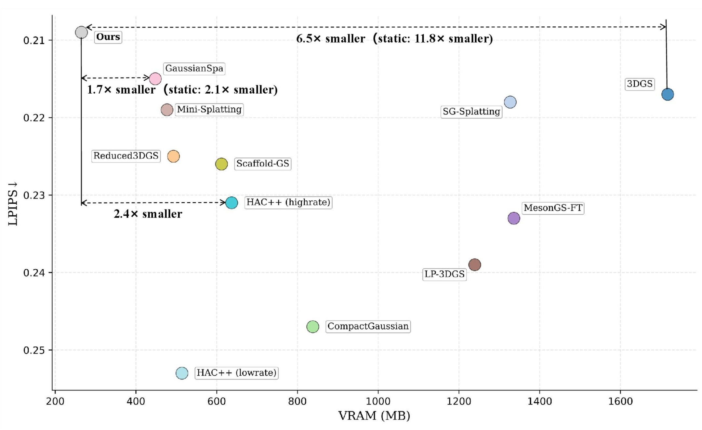

# MEGS²: Memory-Efficient Gaussian Splatting via Spherical Gaussians and Unified Pruning

 &nbsp;
  &nbsp;
  &nbsp;
 We introduce **MEGS²**, a new framework that finally makes 3D Gaussian Splatting truly memory-efficient for real-time rendering.

  
   
  Comparsion with SOTA 3DGS Compression methods on Mip-NeRF360 dataset

## 📢NEWS
- Sept. 7, 2025: We released our [paper](https://arxiv.org/abs/2509.07021).

## 🔨TODO (Coming soon)
- [ ] Release our WebGL viewer code (with support for various devices)
- [ ] Release our training code

